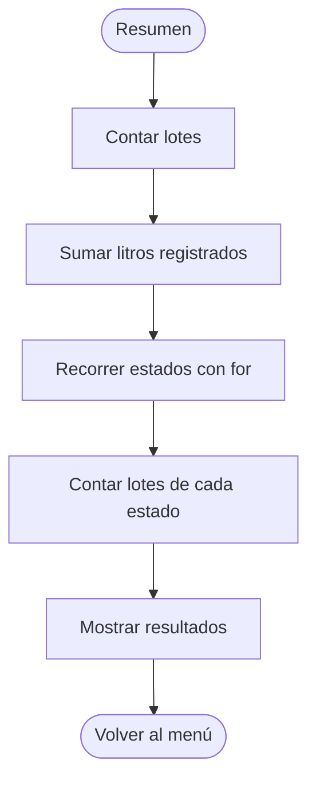

# 05 resumen

```mermaid
flowchart TD
 A([Resumen]) --> B[Contar lotes]
 B --> C[Sumar litros registrados]
 C --> D[Recorrer estados con for]
 D --> E[Contar lotes de cada estado]
 E --> F[Mostrar resultados]
 F --> Z([Volver al menú])
```

En registro y actualización, un error de escritura muestra un aviso y vuelve al menú sin confirmar el cambio.
